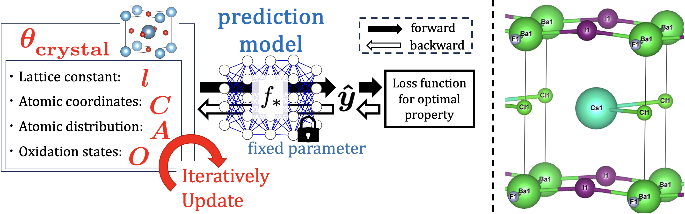
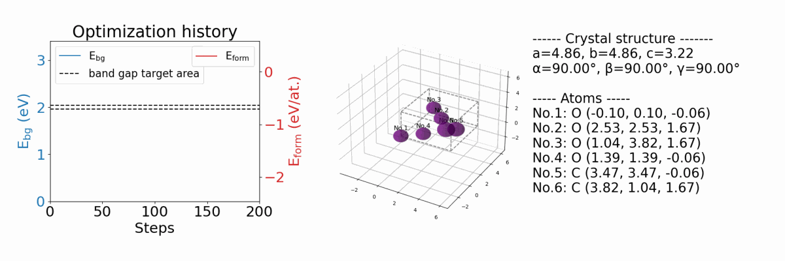

# SMOACS: Simultaneous Multi-property Optimization using Adaptive Crystal Synthesizer

## Overview

**SMOACS** is a framework that utilizes state-of-the-art property prediction models and their gradients to directly optimize input crystal structures for multiple targeted properties simultaneously. It enables the integration of adaptive constraints into the optimization process without necessitating model retraining. This allows for optimizing targeted properties while maintaining specific crystal structures, such as perovskites, even with models trained on diverse crystal types.






## Paper
For detailed information, please refer to our paper:

[Adaptive Constraint Integration for Simultaneously Optimizing Crystal Structures with Multiple Targeted Properties](Insert_Link_Here)

<!-- 
If you use this work in your research, please cite:

```bibtex
@article{yourpaper2023,
  title={Adaptive Constraint Integration for Simultaneously Optimizing Crystal Structures with Multiple Targeted Properties},
  author={Your Name},
  journal={arXiv preprint arXiv:XXXX.XXXXX},
  year={2024}
}
```
-->

## Enviorment
```
torch==2.2.1
pymatgen==2023.10.11
SMACT==2.2.5
jarvis-tools==2023.9.20
dgl==1.1.2
alignn==2024.4.10
numpy==1.25.2
```


### Preparation
You need to download the pretrained weights for Crystalformers from their [GitHub page](https://github.com/omron-sinicx/crystalformer) and place them in the `models/crystalformer` directory. The weights for ALIGNN are automatically downloaded from [figshare](https://figshare.com/projects/ALIGNN_models/126478).


## Usage
Run `python main.py` for a small demonstration. Modify the arguments as necessary.
If you want to use larger size of initial crystal structures dataset, please run `python create_data.py`. You can find larger size of initial crystal structures dataset in `./data`.

Run `python main.py` for a demonstration. Modify the arguments as needed.
If you'd like to use a larger initial crystal structure dataset, please run 'python create_data.py'. You can find the larger dataset in the './data' directory.


```python
main_experiment(
    dir_path = './initial_crystal_candidates/structures_from_MEGNet', # directory of initial crystal structures
    mask_data_path = './mask_arrays/mask_dict_super_common.npz', # atomic mask array
    radii_data_path = None, # ionic radii array
    exp_name = 'S_Cry_random', # experiment name. 
    model_name = 'Crystalformer' , # model name. 'Crystalformer' or 'ALIGNN'
    num_steps=200, # optimization steps
    num_candidate=8, # The number of initial crystal structures
    num_batch_crystal=8, # Batch size to optimize 
    
    # prediction model, loss and criteria for each target values
    prediction_loss_setting_dict ={ 
        'bandgap': {
            'prediction_model':None,
            'loss_function':{
                'func_name':'GapLoss',
                'margin':0.04, # (eV)
                'target_bandgap':2.0, # (eV)
                'mode':'band',
                'coef':1.0, # coefficient for the loss 
            },
            'criteria_max':2.04, # optimized values should be less than this value
            'criteria_min':1.96, # optimizedvalues should be more than this value
        },
        'e_form':{
            'prediction_model':None,
            'loss_function':{
                'func_name':'FormationEnegryLoss',
                'e_form_min':None,
                'e_form_coef':1.0, # coefficient for the loss 
            },
            'criteria_max':-0.5, # optimized values should be less than this value
            'criteria_min':None, # optimizedvalues should be more than this value
        }
    },
    atomic_dictribution_loss_setting_dict = {},
    site_atom_oxidation_dict  = {'Atom_settings': {}, 'use_ionic_radii':False},
    limit_coords_displacement= None, # limiation for displacement of fractional coordindates
    lattice_lr= 0.01, # learning rate for lattice (a,b,c,α,β,γ) optimization
    coords_lr= 0.02, # learning rate for fractional coordinates
    atom_lr= 0.6,  # learning rate for atomic distribution and oxidation state configuration parameters
)    

```


## Output files
| file path | description |
| ---- | ---- |
|`.results/{exp_name}/result_summary.csv`| summary scores|
| `.results/{exp_name}/result.csv`| scores for each optimized crystal structures |
| `.results/{exp_name}/result.npz`| detailed scores with numpy |
|`.results/{exp_name}/poscar/*.vasp`| optimized crystal structures written as POSCAR files|
| `.results/{exp_name}/history_img.png`| an image file of optimization history. (if you optimize both band gap and formation energy) |


### details for `result.csv`
| column | description |
| ---- | ---- |
| `original_fnames`| file names of initial structures in the directory of `dir_path` |
| `batch_abc` | values of lengths of crystal vectors $a,b,c$ |
| `batch_angle`| values of angles of crystal vector $\alpha,\beta,\gamma$|
| `*_onehot` | optimized values with one-hot atomic distributions. e.g., `bandgap_onehot`|
| `loss_*_onehot` |loss values after optimization with one-hot atomic distributions. e.g., `loss_bandgap_onehot`|
| `*_success` | whether to meet its criterion|
| `valid_structure` | whether to meet both `is_neutral` and `minbond_less_than_0.5`|
| `is_neutral`  | electrically neutrality|
| `minbond_less_than_0.5` | whether the all bonds are larger than 0.5Å |
| `is_neutral`  | electrically neutrality|
| `ox_states`  | oxidation numbers if the structure is electrically neutral. The order is the same as `elements`.|
| `perov_success`  | whether to  meet both `tolerance_success` and `perov_coords`|
| `tolerance_success`  | whether tolerance value $t$ meets its criterion|
| `perov_coords`  | whether displacements of fractional coordinates are within $\epsilon(=0.15)$ |
| `success`  | overall success. If the following conditions are met at the same time: `*_success` and `valid_structure` for non-perovskite optimization; `*_success`, `valid_structure` and `perov_success` for perovskite optimization|


## sample usages

### Band gap and Formation Energy Optimization Regardless of the Crystal Stuctures with Crystalformer
A setting for S(Cry) on Table 2 in our paper.

```python
main_experiment(
    dir_path = './initial_crystal_candidates/structures_from_MEGNet', # directory of initial crystal structures
    mask_data_path = './mask_arrays/mask_dict_super_common.npz', # atomic mask array
    radii_data_path = None, # ionic radii array
    exp_name = 'S_Cry_random', # experiment name. 
    model_name = 'Crystalformer' , # model name. 'Crystalformer' or 'ALIGNN'
    num_steps=200, # optimization steps
    num_candidate=8, # The number of initial crystal structures
    num_batch_crystal=8, # Batch size to optimize 
    
    # prediction model, loss and criteria for each target values
    prediction_loss_setting_dict ={ 
        'bandgap': {
            'prediction_model':None,
            'loss_function':{
                'func_name':'GapLoss',
                'margin':0.04, # (eV)
                'target_bandgap':2.0, # (eV)
                'mode':'band',
                'coef':1.0, # coefficient for the loss 
            },
            'criteria_max':2.04, # optimized values should be less than this value
            'criteria_min':1.96, # optimizedvalues should be more than this value
        },
        'e_form':{
            'prediction_model':None,
            'loss_function':{
                'func_name':'FormationEnegryLoss',
                'e_form_min':None,
                'e_form_coef':1.0, # coefficient for the loss 
            },
            'criteria_max':-0.5, # optimized values should be less than this value
            'criteria_min':None, # optimizedvalues should be more than this value
        }
    },
    atomic_dictribution_loss_setting_dict = {},
    site_atom_oxidation_dict  = {'Atom_settings': {}, 'use_ionic_radii':False},
    limit_coords_displacement= None, # limiation for displacement of fractional coordindates
    lattice_lr= 0.01, # learning rate for lattice (a,b,c,α,β,γ) optimization
    coords_lr= 0.02, # learning rate for fractional coordinates
    atom_lr= 0.6,  # learning rate for atomic distribution and oxidation state configuration parameters
)    

```


### Band gap and Formation Energy Optimization While Preserving Perovskite stuctures with ALIGNN
The settings are almost the same as S(ALI) on the Table 3 in our paper, but `ALIGNN_num_update_graphs` is changed for a small demonstration. The file `./initial_crystal_candidates/random_perovskite_1` contains a randomly shaped $\mathrm{BaTiO_3}$. The oxidation states of the Ba, Ti, and O sites are specified using `site_atom_oxidation_dict{'Atom_settings'}`.
```python

# ALIGNN / perovskite structure
main_experiment(
    dir_path = './initial_crystal_candidates/random_perovskite_1', # directory of initial crystal structures
    mask_data_path = './mask_arrays/ionic_mask_dict_super_common.npz', # atomic mask array
    radii_data_path = './mask_arrays/ionic_radii_dict_super_common.npz',  # ionic radii array
    exp_name = 'S_ALI_perov',
    model_name = 'ALIGNN' , #'Crystalformer' or 'ALIGNN'

    num_steps=200,
    num_candidate=16,
    num_batch_crystal=16,# 
    
    prediction_loss_setting_dict ={
        'bandgap': {
            'alignn_model_name':"mp_gappbe_alignnn",
            'prediction_model':None,
            'loss_function':{
                'func_name':'GapLoss',
                'margin':0.04, # (eV)
                'target_bandgap':3.5, # (eV)
                'mode':'band',
                'coef':1.0,
            },
            'criteria_max':3.54, # optimized values should be less than this value
            'criteria_min':3.46, # optimizedvalues should be more than this value
        },
        'e_form':{
            'alignn_model_name':"mp_e_form_alignnn",
            'prediction_model':None,
            'loss_function':{
                'func_name':'FormationEnegryLoss',
                'e_form_min':None,
                'e_form_coef':1.0,
            },
            'criteria_max':-0.5, # optimized values should be less than this value
            'criteria_min':None, # optimizedvalues should be more than this value
        }
    },
    atomic_dictribution_loss_setting_dict = {
        'tolerance':{
            'loss_function':{
                'func_name':'tolerance',
                'coef':1.0,
                'tolerance_range':(0.8, 1.0),
            },
            'criteria_max':1.0, # optimized values should be less than this value
            'criteria_min':0.8, # optimizedvalues should be more than this value
        },
    },
    site_atom_oxidation_dict  = {
            # site-wise specification of oxidation numbers
            'Atom_settings': {
                'Ba': {'ox_patterns':[2,1], 'site_id':0}, 
                'Ti': {'ox_patterns':[4,2], 'site_id':1}, 
                'O': {'ox_patterns':[-2,-1], 'site_id':2},
            },
            'use_ionic_radii':True # use ionic radius values to calculate tolerance t.
    },
    ALIGNN_num_update_graphs = 5,# frequency of graph updating.
    limit_coords_displacement= 0.15, # limiation for displacement of fractional coordindates
    perovskite_evaluation = True,  # ionic radii array
    angle_optimization = False, # disable optimization of angle
    atom_lr= 0.00008,
    lattice_lr= 0.5,
    coords_lr= 0.002,
)    
```

### Further Specific Optimization of Perovskite Structure

In addition to the previous optimization: limit the element at the Ti site to either titanium or manganese, and change the optimization range of the angles to between 85° and 95°.

```python

main_experiment(
    exp_name = 'S_Cry_perov_ELM_limited',
    model_name = 'Crystalformer' , #'Crystalformer' or 'ALIGNN' or 'Both
    dir_path = './initial_crystal_candidates/random_perovskite_2',
    mask_data_path = './mask_arrays/ionic_mask_dict_super_common.npz',
    radii_data_path = './mask_arrays/ionic_radii_dict_super_common.npz',

    num_steps=num_steps,
    num_candidate=len(os.listdir('./initial_crystal_candidates/random_perovskite_2')), # the number of initial structures
    num_batch_crystal=len(os.listdir('./initial_crystal_candidates/random_perovskite_2')), # batch size
    prediction_loss_setting_dict ={
        'bandgap': {
            'alignn_model_name':"mp_gappbe_alignnn",
            'prediction_model':None,
            'loss_function':{
                'func_name':'GapLoss',
                'margin':0.04, # (eV)
                'target_bandgap':2.0, # (eV)
                'mode':'band',
                'coef':1.0,
            },
            'criteria_max': 2.04,
            'criteria_min': 1.96,
        },
        'e_form':{
            'alignn_model_name':"mp_e_form_alignnn",
            'prediction_model':None,
            'loss_function':{
                'func_name':'FormationEnegryLoss',
                'e_form_min':None,
                'e_form_coef':1.0,
            },
            'criteria_max': -0.5, # optimized values should be less than this value
            'criteria_min': None, # optimizedvalues should be more than this value
        }
    },
    atomic_dictribution_loss_setting_dict = {
        'tolerance':{
            'loss_function':{
                'func_name':'tolerance',
                'coef':1.0,
                'tolerance_range':(0.8, 1.0),
            },
            'criteria_max':1.0, # optimized values should be less than this value
            'criteria_min':0.8, # optimizedvalues should be more than this value
        },
    },
    site_atom_oxidation_dict  = {
            'Atom_settings': {
                'Ba': {'ox_patterns':[2], 'site_id':0}, 
                'Ti': {'element':['Mn', 'Ti'], 'ox_patterns':[4],'site_id':1},  # Limit the element at the Ti site to either titanium or manganese
                'O': {'ox_patterns':[-2], 'site_id':2},
            },
            'use_ionic_radii':True
    },

    limit_coords_displacement= 0.15, 
    angle_range = (85, 95),
    perovskite_evaluation = True,
    atom_lr= 6.0,
    lattice_lr= 0.01,
    coords_lr= 0.02,
)    

```


### Identifying the Most Stable Crystal Structures
We experimented to see if the crystal structure of metallic silicon with a zero band gap could be identified. Initially, we extracted structures from the MEGNet dataset that contained only one atom besides Si, using them as the initial structure. The atomic distribution was fixed with a one-hot vector indicating silicon, and only the lattice constants were optimized. The target properties for optimization were a zero band gap and formation energy minimization. We chose silicon structures from the MEGNet dataset with a band gap of 0 eV as the reference and compared these with the optimized structures that exhibited the lowest formation energy. See details for Section A.3 in our paper.

```python
main_experiment(
    exp_name = 'metaric_Silicon',
    model_name = 'Crystalformer' , 
    dir_path = './initial_crystal_candidates/one_atom_site_lattice_except_Si',
    mask_data_path = './mask_arrays/ionic_mask_dict_super_common.npz',
    radii_data_path = './mask_arrays/ionic_radii_dict_super_common.npz',

    num_steps=num_steps,
    num_candidate=len(os.listdir('./initial_crystal_candidates/one_atom_site_lattice_except_Si')),
    num_batch_crystal=len(os.listdir('./initial_crystal_candidates/one_atom_site_lattice_except_Si')),
    prediction_loss_setting_dict ={
        'bandgap': {
            'prediction_model':None,
            'loss_function':{
                'func_name':'GapLoss',
                'margin':0.00, # (eV)
                'target_bandgap':0.0, # (eV)
                'mode':'band',
                'coef':1.0,
            },
            'criteria_max':0.0, # optimized values should be less than this value
            'criteria_min':0.0, # optimizedvalues should be more than this value
        },
        'e_form':{
            'prediction_model':None,
            'loss_function':{
                'func_name':'FormationEnegryLoss',
                'e_form_min':None,
                'e_form_coef':1.0,
            },
            'criteria_max':-0.5, # optimized values should be less than this value
            'criteria_min':None, # optimizedvalues should be more than this value
        }
    },
    atomic_dictribution_loss_setting_dict = {},
    site_atom_oxidation_dict  = {
            'Atom_settings': {
                '*': {'element':'Si', 'site_id':-999} # '*' is wildcard. It means all elements are converted to Silicon.
            }, 
            'use_ionic_radii':False,
    },
    atom_lr = 0.0, # element is fixed to siliton
    lattice_lr = 0.01, 
    coords_lr = 0.01,
    neutral_check=False, # skip neutrality check
)    

from jarvis.core.atoms import Atoms
import pandas as pd
import numpy as np

df = pd.read_csv('./results/metaric_Silicon/result.csv').sort_values(['loss_bandgap_onehot', 'e_form_onehot']).head(30)
d = np.load('./results/metaric_Silicon/result.npz', allow_pickle=True)
for lattice_id in df.index.values:
        fname = f"Optimized_based_on_{d['original_fnames'][lattice_id]}"
        atom = Atoms.from_poscar(os.path.join('./results/metaric_Silicon/poscar', fname))
        print(f'initial lattice_id:{d["original_fnames"][lattice_id]}  ', atom.lattice.abc, atom.lattice.angles, atom.coords,"  pred ef(eV):",df.loc[lattice_id,"e_form_onehot"])

```


### Optimizing only formation energy either band gap

Formation energy optimization
```python
main_experiment(
    dir_path = './initial_crystal_candidates/structures_from_MEGNet',
    mask_data_path = './mask_arrays/mask_dict_super_common.npz',
    radii_data_path = None,
    exp_name = 'S_Cry_random_ef',
    model_name = 'Crystalformer' ,
    num_steps=200,
    num_candidate=8,
    num_batch_crystal=8, 
    
    prediction_loss_setting_dict ={
        'e_form':{
            'alignn_model_name':"mp_e_form_alignnn",
            'prediction_model':None,
            'loss_function':{
                'func_name':'FormationEnegryLoss',
                'e_form_min':None,
                'e_form_coef':1.0,
            },
            'criteria_max': -0.5, # optimized values should be less than this value
            'criteria_min': None, # optimizedvalues should be more than this value
        },

    },
    atomic_dictribution_loss_setting_dict = {},
    site_atom_oxidation_dict  = {'Atom_settings': {}, 'use_ionic_radii':False},
    atom_lr= 6.0,
    lattice_lr= 0.01,
    coords_lr= 0.02,
)    

```

band gap optimization
```python
# Crystalformer / random structure
main_experiment(
    dir_path = './initial_crystal_candidates/structures_from_MEGNet',
    mask_data_path = './mask_arrays/mask_dict_super_common.npz',
    radii_data_path = None,
    exp_name = 'S_Cry_random_bg',
    model_name = 'Crystalformer' ,
    num_steps=200,
    num_candidate=8,
    num_batch_crystal=8, 
    
    prediction_loss_setting_dict ={
        'bandgap': {
            'prediction_model':None,
            'loss_function':{
                'func_name':'GapLoss',
                'margin':0.04, # (eV)
                'target_bandgap':2.0, # (eV)
                'mode':'band',
                'coef':1.0,
            },
            'criteria_max' : 2.04,
            'criteria_min' : 1.96,
        }
    },
    atomic_dictribution_loss_setting_dict = {},
    site_atom_oxidation_dict  = {'Atom_settings': {}, 'use_ionic_radii':False},
    atom_lr= 6.0,
    lattice_lr= 0.01,
    coords_lr= 0.02,
)    
```

## License

This project is licensed under the MIT License.　Parts of this project include code from the National Institute of Standards and Technology (NIST). The NIST code is provided under the NIST license terms.　For full license details, please see the [LICENSE file](./LICENSE).
