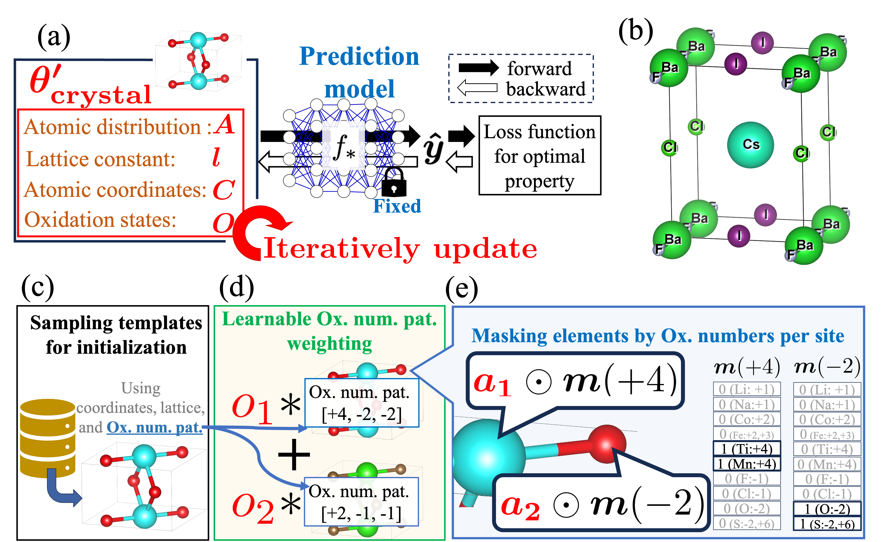

# Rethinking Gradient-Based Methods: Multi-Property Materials Design Beyond Differentiable Targets

**Simultaneous Multi-property Optimization using Adaptive Crystal Synthesizer (SMOACS)** is a framework that utilizes state-of-the-art property prediction models and their gradients to directly optimize input crystal structures for multiple targeted properties simultaneously. It enables the integration of adaptive constraints into the optimization process without necessitating model retraining. This allows for optimizing targeted properties while maintaining specific crystal structures, such as perovskites, even with models trained on diverse crystal types.




## Paper
For detailed information, please refer to our paper:

[Rethinking Gradient-Based Methods: Multi-Property Materials Design Beyond Differentiable Targets](https://arxiv.org/abs/2410.08562)

### Citation

If you use this work in your research, please cite:

```text
@article{afujii2024,
  title={Adaptive Constraint Integration for Simultaneously Optimizing Crystal Structures with Multiple Targeted Properties},
  author={Akihiro FUJII, Yoshitaka Ushiku, Koji Shimizu, Anh Khoa Augustin Lu, Satoshi Watanabe },
  journal={arXiv preprint arXiv:2410.08562},
  year={2024}
}
```

The code in this repository uses the code of Crystalformer and ALIGNN. Crystalformer's pretrained models provided in [Crystalformer's official repository](https://github.com/omron-sinicx/crystalformer) and ALIGNN's pretrained models provided in [ALIGNN's official repository](https://github.com/usnistgov/alignn). Thus, if you use our code in your projects, please cite both our work and the Crystalformer paper or ALIGNN:

### Crystalformer
```text
@inproceedings{taniai2024crystalformer,
  title     = {Crystalformer: Infinitely Connected Attention for Periodic Structure Encoding},
  author    = {Tatsunori Taniai and
               Ryo Igarashi and
               Yuta Suzuki and
               Naoya Chiba and
               Kotaro Saito and
               Yoshitaka Ushiku and
               Kanta Ono
               },
  booktitle = {The Twelfth International Conference on Learning Representations},
  year      = {2024},
  url       = {https://openreview.net/forum?id=fxQiecl9HB}
}
```

### ALIGNN
```text
@article{choudhary2021atomistic,
  title={Atomistic line graph neural network for improved materials property predictions},
  author={Choudhary, Kamal and DeCost, Brian},
  journal={npj Computational Materials},
  volume={7},
  number={1},
  pages={185},
  year={2021},
  publisher={Nature Publishing Group UK London}
}
```


## Requirements

### Dependencies


This project uses Python, PyTorch (with CUDA 12.4), and other scientific libraries.  
We use `venv` for environment isolation, install PyTorch manually via `pip`, and manage remaining dependencies with `Poetry`.

### 📦 Environment Setup Instructions (venv + pip + poetry)


#### 1. Create a virtual environment (Python 3.10)

```bash
python3.10 -m venv venv
source venv/bin/activate  
```

#### 2. Install Poetry (if not installed)
```bash
curl -sSL https://install.python-poetry.org | python3 -
export PATH="$HOME/.local/bin:$PATH"

```
#### 3. Install related libraries using Poetry
⚠️ Note: PyTorch, DGL, and PyG are not managed by Poetry due to their CUDA-specific wheels and version compatibility complexity.
```bash
poetry install --no-root
```

#### 4. Install PyTorch (CUDA 12.4) and related libraries
⚠️ These libraries have complex dependencies (especially CUDA compatibility) and must be installed manually via pip.

```bash
pip install --upgrade pip

# Install PyTorch with CUDA 12.4
pip install torch==2.4.0 torchvision==0.19.0 torchaudio==2.4.0 --index-url https://download.pytorch.org/whl/cu124

# Install PyTorch Geometric dependencies
pip install torch_geometric
pip install pyg_lib torch_scatter torch_sparse torch_cluster torch_spline_conv -f https://data.pyg.org/whl/torch-2.4.0+cu124.html

# Install DGL (CUDA 12.4 build)
pip uninstall dgl -y 
pip install  dgl -f https://data.dgl.ai/wheels/torch-2.4/cu124/repo.html
```

### Template Structures
Template structures are provided in the `./data/raw` directory.  
If you want to create new template structures, run the following command:

```bash
python create_dataset.py
```

### Pretrained model weights
You need to download the pretrained weights (e.g. `default.json` and `megnet-bandgap-layer7.ckpt`) for Crystalformers from their [GitHub page](https://github.com/omron-sinicx/crystalformer) and place them in the `models/crystalformer` directory. The weights for ALIGNN are automatically downloaded from [figshare](https://figshare.com/projects/ALIGNN_models/126478).


## Demonstration with demo.ipynb

A simple demonstration is available in [`demo.ipynb`](./demo.ipynb), which shows how to run structure optimization with pretrained models using a few example inputs.

This notebook is a good starting point if you want to test the pipeline without setting up the full environment or writing scripts.


## Sructure optimization
The main script `main.py` optimizes and evaluates structures towards specified targeted properties under constraints.　Evaluation results are output as CSV files. Please refer to the [Output files section](#output-filesoutput-files) for details.


### Targeting exceptional properties
Targeting exceptional propoerties.

(1) Maximizing critical temperature of superconductiviy ($T_c$).
```bash
poetry run python main.py --model_name ALIGNN --task tc_and_efrom --target_val maximization --e_form_coef 0.0 --e_form_criteria 1E6
```

(2) Targeting exceptional band gap values.

```bash
poetry run python main.py --model_name ALIGNN  --target_val 4.5 --e_form_coef 0.0 --e_form_criteria 1E6
```
or
```bash
poetry run python main.py --model_name Crystalformer  --target_val 4.5 --e_form_coef 0.0 --e_form_criteria 1E6
```

### Multi-property design of perovskite structures
Optimizing three properties—band gap, formation energy, and the tolerance factor $t$—under two
constraints: charge neutrality and preservation of perovskite structures (unit cell) .

```bash
poetry run python main.py --model_name ALIGNN --target_val 0.5 --structure perovskite
```
or 

```bash
poetry run python main.py --model_name Crystalformer --target_val 0.5 --structure perovskite
```

### Scaling to large atomic configurations: optimization of 135-atom perovskites
Optimizing three properties—band gap, formation energy, and the tolerance factor $t$—under two
constraints: charge neutrality and preservation of large perovskite structures ($3\times3\times3$).

```bash
poetry run python main.py --model_name ALIGNN --target_val 4.5 --structure perovskite3x3x3 --b_size 32 --num_candidate 128
```
or
```bash
poetry run python main.py --model_name Crystalformer --target_val 4.5 --structure perovskite3x3x3 --b_size 32 --num_candidate 128
```


### Cross-dataset optimization
Multi-objective optimization using models trained on different dataset.

(1) A MEGNet-based formation energy predictor with a bulk modulus predictor trained on JARVIS-DFT dataset

```bash
python main.py --model_name ALIGNN --task B_and_eform  --target_val 160.0 --training_margin 5.0 --eval_margin 1.0 --structure perovskite 
```


(2) MEGNet band gap predictor with a trained $E_{hull}$ predictor trained on JARVIS-DFT dataset.

```bash
python main.py --model_name ALIGNN --task bg_and_ehull --target_val 0.5 --e_form_criteria 0.5 --structure perovskite
```


## Output files
| file path | description |
| ---- | ---- |
|`.results/{exp_name}/result_summary.csv`| summary scores|
| `.results/{exp_name}/result.csv`| scores for each optimized crystal structures |
| `.results/{exp_name}/result.npz`| detailed scores with numpy |
|`.results/{exp_name}/poscar/*.vasp`| optimized crystal structures written as POSCAR files|
| `.results/{exp_name}/history_img.png`| an image file of optimization history. (if you optimize both band gap and formation energy) |

### Details for `result_summary.csv`


This file provides a summary of the optimization performance across all generated structures, including metrics such as success rates, uniqueness, and novelty.

| Column | Description |
|--------|-------------|
| `success` | Ratio of structures that satisfy all evaluation criteria (see `success` in the main result file). |
| `*_success` | Ratio of structures that satisfy the criteria of each peoperty or constraint. |
| `tolerance_success` | Ratio of structures that satisfy the tolerance factor constraint. |
| `perov_success` | Ratio of perovskite structures that pass the geometry and coordinate checks. |
| `Tc_above_5.0`, `Tc_above_10.0`, ... | Ratio of structures whose predicted Tc exceeds the specified threshold (used in maximization mode). |
| `is_neutral_cmn` | Ratio of structures that are electrically neutral. |
| `minbond_less_than_0.5` | Ratio of structures with all bond lengths ≥ 0.5Å. |
| `success_nuique_rate` | Fraction of successful structures that are also structurally unique. |
| `newly_megnet_success` | Number of successful structures that are novel (not present in the reference MEGNet dataset). |

This summary helps users understand the effectiveness of the optimization process and the quality of generated candidates at a glance.


### Details for `result.csv`
A file for evaluation result for each optimized structures including successeeded and failed ones.
| column | description |
| ---- | ---- |
| `original_fnames`| file names of initial structures in the directory of `dir_path` |
| `batch_abc` | values of lengths of crystal vectors $a,b,c$ |
| `batch_angle`| values of angles of crystal vector $\alpha,\beta,\gamma$|
| `*_onehot` | optimized values with one-hot atomic distributions. e.g., `bandgap_onehot`|
| `loss_*_onehot` |loss values after optimization with one-hot atomic distributions. e.g., `loss_bandgap_onehot`|
| `*_success` | whether to meet its criterion|
| `Tc_above_5.0`, `Tc_above_10.0`, ... |  whether predicted Tc exceeds the specified threshold (used in maximization mode). |
| `is_neutral_cmn`  | electrical neutrality|
| `minbond_less_than_0.5` | whether the all bonds are longer than 0.5Å |
| `ox_states`  | oxidation numbers (available only if the structure is electrically neutral). The order is the same as `elements`.|
| `perov_success`  | whether to  meet both (85°<$\alpha,\beta,\gamma$< 95°) and `perov_coords`|
| `tolerance_success`  | whether tolerance value $t$ meets its criterion|
| `perov_coords`  | whether the displacements of fractional coordinates are within $\epsilon$ (0.15) |
| `success`  | overall success. If the following conditions are met at the same time: `*_success` and `valid_structure` for non-perovskite optimization; `*_success`, `valid_structure` and `perov_success` for perovskite optimization|


## Results


### Table 2: Targeting exceptional properties: Superconducting critical temperature ($T_c$)
**Success rates for achieving predicted $T_c$ above various thresholds.**  
"CDVAE" shows $T_c$ after structure generation from optimized $z$.  
Percentiles are based on the JARVIS Superconductor dataset.

| $T_c$ (Percentile)        | >3.0 K (>60.3%) | >5.0 K (>73.3%) | >10.0 K (>90.1%) | >15.0 K (>96.3%) |
|---------------------------|-----------------|------------------|------------------|------------------|
| CDVAE                     | 0.43 ± 0.07     | 0.22 ± 0.07      | 0.03 ± 0.02      | 0.02 ± 0.02      |
| **SMOACS**                | **1.00 ± 0.00** | **0.92 ± 0.03**  | **0.54 ± 0.02**  | **0.25 ± 0.02**  |

### Table 3: Targeting exceptional properties: wide band gap
**Success rates for targeted band gap values.**  
S(Cry) and S(ALI) denote SMOACS with Crystalformer and ALIGNN. Percentiles follow the MEGNet dataset.

| Target $E_g$ (eV)<br>(Percentile) | 3.5 ± 0.2<br>(87.6%) | 4.0 ± 0.2<br>(91.6%) | 4.5 ± 0.2<br>(94.4%) | 5.0 ± 0.2<br>(96.5%) |
|----------------------------------|----------------------|----------------------|----------------------|----------------------|
| CDVAE                            | 0.03 ± 0.01          | 0.01 ± 0.01          | 0.01 ± 0.01          | 0.02 ± 0.01          |
| **S(ALI)**                       | **0.70 ± 0.02**      | **0.67 ± 0.04**      | **0.64 ± 0.02**      | **0.61 ± 0.05**      |
| **S(Cry)**                       | **0.65 ± 0.03**      | **0.67 ± 0.02**      | **0.65 ± 0.03**      | **0.67 ± 0.01**      |

### Table 4: Multi-property design of perovskite structures

**Experiments optimizing perovskite structures.**  
"SC rate" refers to the proportion of samples that simultaneously satisfy the five criteria:  (A) the band gap falls within the target range,  (B) formation energy is below −0.5 eV/atom,  (C) the tolerance factor $t \in [0.8, 1.0]$,  (D) the structure is charge-neutral, and  (E) the structure approximates a perovskite.  Criterion (E) is fulfilled when:  (i) internal coordinates deviate by less than ±0.15 from those of a typical perovskite, and  (ii) crystal axis angles are between 85° and 95°.  

| Target $E_g$ (eV) | Method  | SC rate        | (A)$E_g$ | (B)$E_f$ | (C)$t$  | (D)Neut. | (E)Perov. |
|------------------|---------|----------------|----------|----------|---------|----------|-----------|
| 0.5 ± 0.2        | FTCP    | 0.00 ± 0.00    | 0.00     | **1.00** | 0.23    | 0.99     | 0.23      |
|                  | CDVAE   | 0.00 ± 0.00    | 0.21     | 0.42     | 0.00    | 0.38     | 0.00      |
|                  | TPE     | 0.09 ± 0.01    | **1.00** | 0.46     | 0.30    | 0.95     | **1.00**  |
|                  | S(ALI)  | 0.20 ± 0.02    | 0.71     | 0.46     | 0.44    | **1.00** | **1.00**  |
|                  | S(Cry)  | **0.23 ± 0.03**| 0.62     | 0.86     | 0.37    | **1.00** | **1.00**  |
|------------------|---------|----------------|----------|----------|---------|----------|-----------|
| 2.5 ± 0.2        | FTCP    | 0.00 ± 0.00    | 0.00     | **1.00** | 0.24    | 0.99     | 0.24      |
|                  | CDVAE   | 0.00 ± 0.00    | 0.04     | 0.41     | 0.00    | 0.38     | 0.00      |
|                  | TPE     | 0.06 ± 0.01    | **1.00** | 0.53     | 0.22    | 0.70     | **1.00**  |
|                  | S(ALI)  | **0.39 ± 0.01**| 0.63     | 0.96     | 0.64    | **1.00** | **1.00**  |
|                  | S(Cry)  | 0.24 ± 0.01    | 0.56     | 0.88     | 0.46    | **1.00** | **1.00**  |

### Table 5: Scaling to large atomic configurations: optimization of 135-atom perovskites

**Experiments optimizing for various band gaps on preserving $3 \times 3 \times 3$ perovskite structures.**  

| Target $E_g$ (Percentile)  | Method   | SC rate        | (A)$E_g$ | (B)$E_f$ | (C)$t$  | (D)Neut. | (E)Perov. |
|----------------------------|----------|----------------|----------|----------|---------|----------|-----------|
| 4.0 ± 0.2 eV (91.6%)       | FTCP     | 0.00 ± 0.00    | 0.00     | **1.00** | 0.00    | N/A      | 0.00      |
|                            | CDVAE    | 0.00 ± 0.00    | 0.00     | 0.24     | 0.00    | N/A      | 0.00      |
|                            | TPE(/N)  | 0.00 ± 0.00    | 0.00     | 0.00     | 0.22    | N/A      | **1.00**  |
|                            | S(ALI)   | **0.42 ± 0.01**| **0.75** | **1.00** | **0.47**| **1.00** | **1.00**  |
|                            | S(Cry)   | 0.03 ± 0.02    | 0.17     | 0.11     | 0.44    | **1.00** | **1.00**  |
|----------------------------|----------|----------------|----------|----------|---------|----------|-----------|
| 5.0 ± 0.2 eV (96.5%)       | FTCP     | 0.00 ± 0.00    | 0.00     | **1.00** | 0.00    | N/A      | 0.00      |
|                            | CDVAE    | 0.00 ± 0.00    | 0.00     | 0.24     | 0.00    | N/A      | 0.00      |
|                            | TPE(/N)  | 0.00 ± 0.00    | 0.00     | 0.00     | 0.18    | N/A      | **1.00**  |
|                            | S(ALI)   | **0.35 ± 0.01**| **0.79** | **1.00** | **0.41**| **1.00** | **1.00**  |
|                            | S(Cry)   | 0.04 ± 0.02    | 0.15     | 0.12     | 0.41    | **1.00** | **1.00**  |

### Cross dataset optimization

**Table 6: Results of optimizing perovskite structures for targeted band gaps using a MEGNet band gap predictor and a JARVIS-DFT $E_{\mathrm{hull}}$ predictor.**  
Success rate is defined as satisfying all five criteria (A)–(E). 

| Target $E_g$ (Percentile)  | Success rate     | (A)$E_g$ | (B)$E_{\mathrm{hull}}$ | (C)$t$  | (D)Neut. | (E)Perov. |
|----------------------------|------------------|----------|------------------------|---------|----------|-----------|
| 4.0 ± 0.2 eV (91.6%)       | 0.52 ± 0.05      | 0.60     | 0.87                   | 0.82    | 1.00     | 1.00      |
| 4.5 ± 0.2 eV (94.4%)       | 0.54 ± 0.02      | 0.62     | 0.86                   | 0.82    | 1.00     | 1.00      |
| 5.0 ± 0.2 eV (96.5%)       | 0.51 ± 0.03      | 0.60     | 0.84                   | 0.79    | 1.00     | 1.00      |


**RTable 7: esults of optimizing perovskite structures for targeted bulk modulus (denoted as "$B$") values using a JARVIS-DFT based bulk modulus predictor and a MEGNet-based formation energy predictor.**  
Success rate is defined as satisfying all five criteria (A)–(E).
| Target $B$ (Percentile)       | Success rate     | (A)$B$  | (B)$E_f$ | (C)$t$  | (D)Neut. | (E)Perov. |
|-------------------------------|------------------|---------|----------|---------|----------|-----------|
| 120.0 ± 10.0 GPa (75.8%)      | 0.31 ± 0.05      | 0.68    | 0.80     | 0.55    | 1.00     | 1.00      |
| 160.0 ± 10.0 GPa (86.6%)      | 0.34 ± 0.04      | 0.77    | 0.70     | 0.65    | 1.00     | 1.00      |
| 200.0 ± 10.0 GPa (93.7%)      | 0.10 ± 0.02      | 0.76    | 0.41     | 0.27    | 1.00     | 1.00      |
